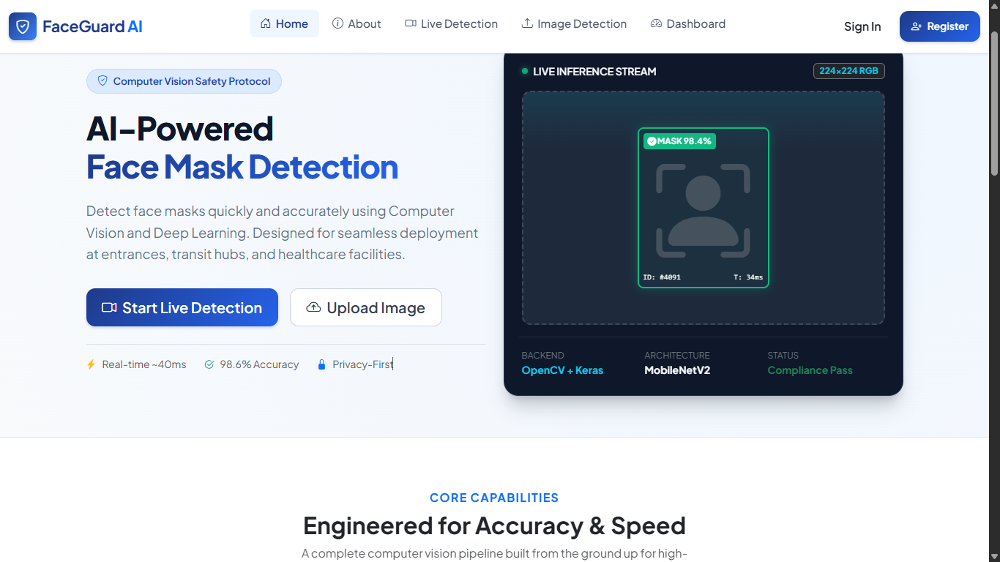
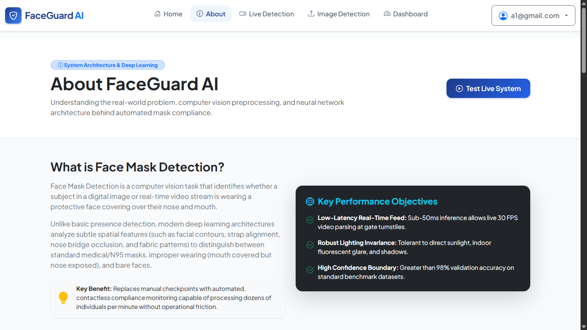
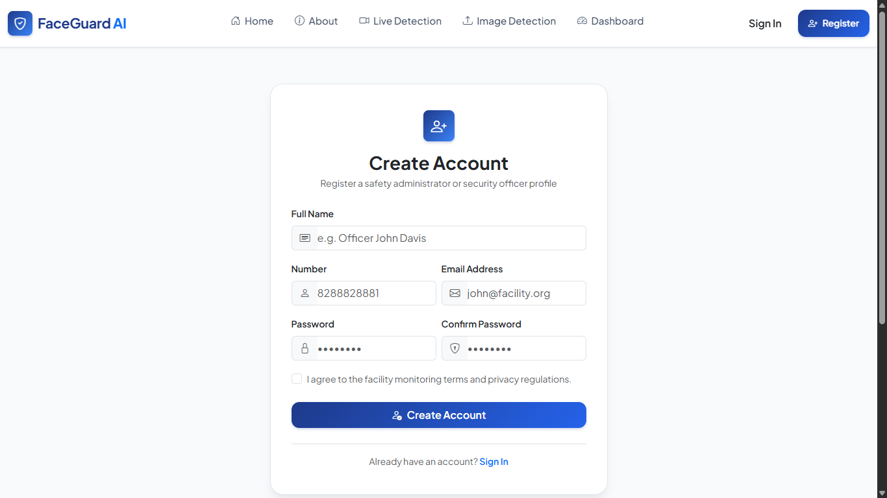
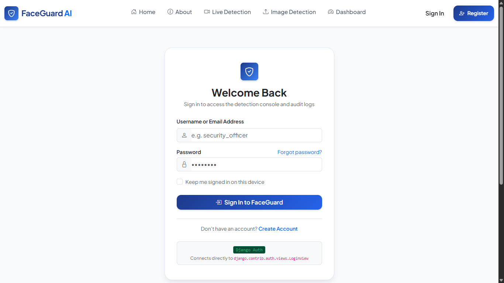
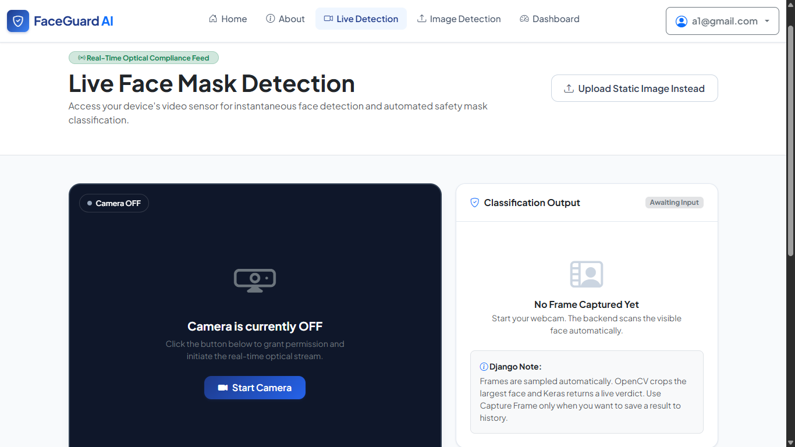
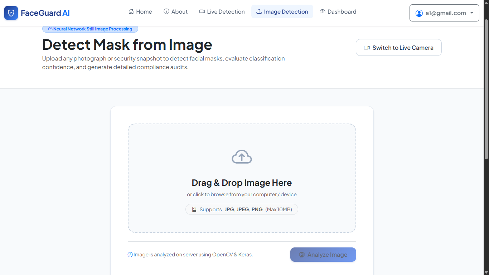
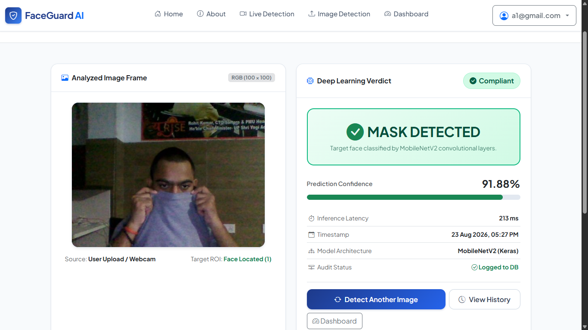
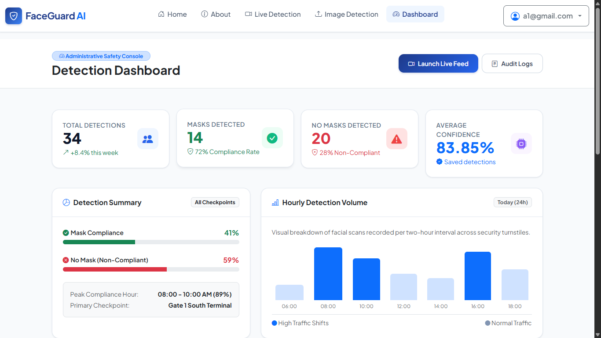
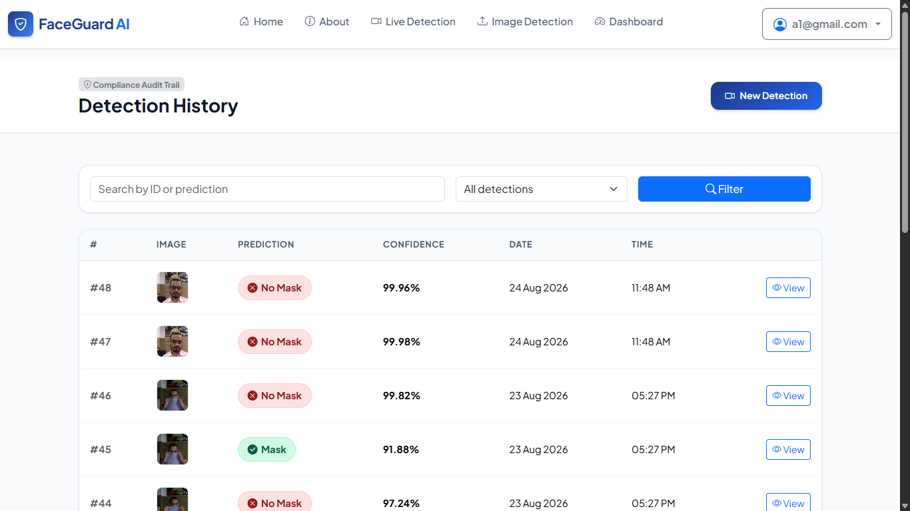

# 😷 FaceGuard AI - Face Mask Detection System

FaceGuard AI is a full-stack **AI-powered Face Mask Detection System** developed using **Django, OpenCV, Keras, HTML, CSS, JavaScript, and SQLite**.

The application allows users to upload an image or capture a frame using a webcam. It detects the largest frontal face using OpenCV, analyzes multiple facial regions using a trained Keras deep-learning model, and predicts whether the person is wearing a **Mask** or **No Mask**.

---

## 🚀 Features

* 🔐 User Registration and Login
* 👤 User Authentication
* 📤 Image Upload Detection
* 📷 Webcam / Live Camera Capture
* 📷 Real-time continuous video mask detection
* 🙂 Automatic Face Detection using OpenCV
* 🧠 Machine Learning based Mask Detection
* 🔍 Multi-region Face Analysis
* 😷 Mask / No Mask Classification
* 📊 Prediction Score Processing
* 📜 User Detection History
* 💾 SQLite Database Integration
* 📱 Responsive User Interface
* 📱 Mobile responsive
* 🔒 User-specific detection records

---

## 🛠️ Tech Stack

### Backend

* Python
* Django

### Machine Learning

* TensorFlow
* Keras
* OpenCV
* NumPy

### Frontend

* HTML5
* CSS3
* Bootstrap
* JavaScript

### Database

* SQLite

### Tools

* Git
* GitHub
* VS Code

---

## 🧠 How FaceGuard AI Works

The FaceGuard AI detection process follows these steps:

1. The user logs into the application.
2. The user uploads an image or captures an image using the webcam.
3. The backend validates and safely processes the received image.
4. OpenCV detects the largest frontal face in the image.
5. The detected face is processed into multiple regions:

   * Full Face
   * Lower Face
   * Nose Region
6. Each region is prepared for the trained Keras model.
7. The Machine Learning model generates prediction scores for each region.
8. The application combines the prediction scores.
9. The final result is classified as:

   * **Mask**
   * **No Mask**
10. Selected detection results are stored in SQLite for the authenticated user.

---

## 🔄 System Workflow

```text
User
  ↓
Login / Register
  ↓
Upload Image / Webcam Capture
  ↓
Django Backend
  ↓
Image Validation & Processing
  ↓
OpenCV Face Detection
  ↓
Largest Frontal Face
  ↓
┌─────────────────────────┐
│ Full Face               │
│ Lower Face              │
│ Nose Region             │
└─────────────────────────┘
  ↓
Keras ML Model
  ↓
Prediction Scores
  ↓
Score Combination
  ↓
Mask / No Mask
  ↓
Save Result in SQLite
  ↓
User Detection History
```

---

## 📂 Project Structure

```text
Face-Mask-Detection-System/
│
├── Face_mask_detection/
│   ├── settings.py
│   ├── urls.py
│   ├── wsgi.py
│   └── asgi.py
│
├── mainapp/
│   ├── migrations/
│   ├── static/
│   │   ├── css/
│   │   └── js/
│   │
│   ├── templates/
│   │   ├── components/
│   │   ├── about.html
│   │   ├── base.html
│   │   ├── dashboard.html
│   │   ├── history.html
│   │   ├── home.html
│   │   ├── image_detection.html
│   │   ├── live_detection.html
│   │   ├── login.html
│   │   ├── register.html
│   │   └── result.html
│   │
│   ├── admin.py
│   ├── ml_utils.py
│   ├── models.py
│   ├── tests.py
│   └── views.py
│
├── ml_model/
│   └── face_mask_model.keras
│
├── manage.py
├── requirements.txt
├── .gitignore
└── README.md
```

---

## ⚙️ Installation

### 1. Clone the Repository

```bash
git clone https://github.com/adarsh020106/Face-Mask-Detection-System.git
```

### 2. Navigate to the Project

```bash
cd Face-Mask-Detection-System
```

### 3. Create a Virtual Environment

```bash
python -m venv venv
```

### 4. Activate Virtual Environment

#### Windows

```bash
venv\Scripts\activate
```

#### Linux / macOS

```bash
source venv/bin/activate
```

### 5. Install Dependencies

```bash
pip install -r requirements.txt
```

---

## 🗄️ Database Setup

Run Django migrations:

```bash
python manage.py migrate
```

Optional admin account:

```bash
python manage.py createsuperuser
```

---

## ▶️ Run the Application

Start the Django development server:

```bash
python manage.py runserver
```

Then open:

```text
http://127.0.0.1:8000/
```

---

## 🤖 Machine Learning Model

FaceGuard AI uses a trained **Keras model** for face-mask classification.

Model file:

```text
ml_model/face_mask_model.keras
```

Instead of relying only on a single image region, the application analyzes multiple facial regions to improve the final classification decision.

The system evaluates:

```text
Full Face
    +
Lower Face
    +
Nose Region
    ↓
Combined Prediction
    ↓
Mask / No Mask
```

---

## 📸 Application Modules

### 🏠 Home

Provides an introduction to FaceGuard AI and access to the application's main features.

### 🏠 About

About this project.

### 🔐 Authentication

Users can register and log in to access personalized detection functionality.

### 📤 Image Detection

Allows users to upload an image and perform AI-based face mask detection.

### 📷 Live Detection

Allows users to capture frames using their webcam for mask detection.

### 📊 Dashboard

Provides users with access to their detection information and application features.

### 📜 Detection History

Stores and displays selected previous detection results for the logged-in user.

---

## 🔒 Security & Privacy

* Django authentication is used for user management.
* Detection history is associated with authenticated users.
* Environment-specific and unnecessary files can be excluded using `.gitignore`.
* User-uploaded media should not be committed to the public repository.
* Sensitive credentials should be stored using environment variables.

---

## 📋 Requirements

Main project dependencies include:

```text
Django
TensorFlow
Keras
OpenCV
NumPy
Pillow
```

For the exact dependency versions, check:

```text
requirements.txt
```

---

## 📸 Screenshots

Add screenshots of the application here.

### 🏠 Home Page


### ℹ️ About Page


### Registration Page


### Login Page


### Live Detection Page


### Image Detection Page


### Prediction Result Page


### Dashboard Page


### History Page


---

## 🔮 Future Improvements

* Multiple face detection
* Improved model accuracy
* Additional face-covering classifications
* REST API support
* Cloud deployment
* Advanced analytics dashboard
* Detection statistics and reports

---

## 👨‍💻 Author

**Adarsh Singh**

GitHub: `adarsh020106`

---

## ⭐ Support

If you find this project useful, consider giving the repository a ⭐.

Contributions, suggestions, and improvements are welcome.

---

## 📄 License

This project is intended for educational and learning purposes.


## 👨‍💻 Author

**Adarsh Singh**

- GitHub: [@adarsh020106](https://github.com/adarsh020106)
- Project: FaceGuard AI
- Role: Full-Stack & Machine Learning Developer
